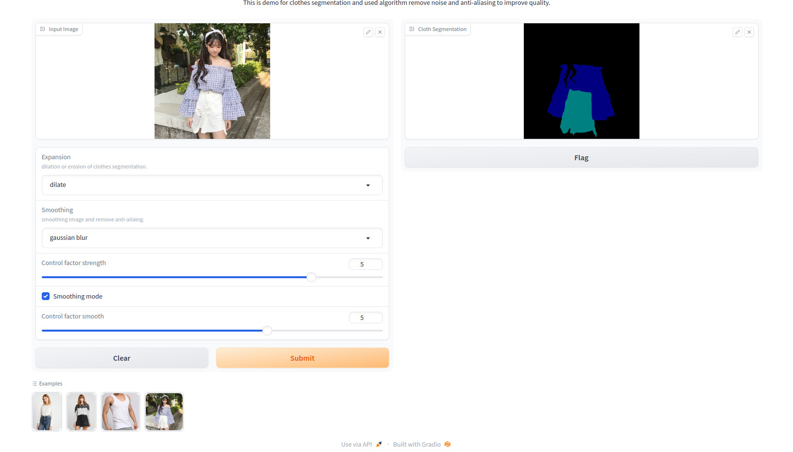

# Segment_Clothes
This is project help clothes segmentation and used algorithm remove noise and anti-aliasing to improve quality. Architecture model UNet used to train
🎁 Segment_Clothes allows clothes segment use architecture model Unet

🎁 This repository use algorithm help remove noise and anti-aliasing to improve quality

## 💬 Where to ask questions
Please use our dedicated channels for questions and discussion. Help is much more valuable if it's shared publicly so that more people can benefit from it.

| Type                            | Platforms      |
| ------------------------------- |----------------|
| 🚨 **Bug Reports**              | [GitHub Issue] |
| 🎁 **Feature Requests & Ideas** | [GitHub Issue] |
| 👩‍💻 **Usage Questions**          | [Github Discussions] |
| 🗯 **General Discussion**       | [Linkedin] or [Gitter Room] |

[GitHub issue]: https://github.com/trungtruc123/Segment_Clothes/issues
[github discussions]: https://github.com/trungtruc123/Segment_Clothes/issues
[gitter room]: https://www.facebook.com/profile.php?id=100038801181933
[linkedin]: https://www.linkedin.com/in/truc-tran-trung-380533149/

## 🔗 Links and Resources
| Type                   | Links                                                                                                       |
|------------------------|-------------------------------------------------------------------------------------------------------------|
| 💼 **Pretrain model**  | [Link download pretrain model](https://huggingface.co/trungtruc/unet_clothes_seg/blob/main/unet_cloth_seg.pth)                                                                            |
| 💾 **Installation**    | [Control-StableDiffusion/README.md](https://github.com/trungtruc123/Segment_Clothes/blob/develop/README.md) |
| 👩‍💻 **Contributing** | [CONTRIBUTING.md](https://github.com/trungtruc123/Segment_Clothes/blob/develop/README.md)                   |

# Inference
- clone the repo `git clone https://github.com/trungtruc123/Segment_Clothes.git
- Install dependencies `pip install -r requirements.txt`
- Download pretrain model and save at folder model ('model/unet_cloth_seg.pth').
- Run `python process.py --image 'input/img1.jpg'`
- Outputs will be saved in `output` folder.

# Demo interface with gradio
- Run `python gradio_seg.py`
- Navigate to local or public url provided by app on successfull execution. 

# Output samples

